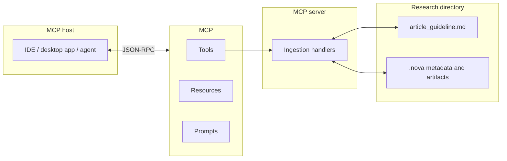

# MCP Server

This repository is **mainly an MCP (Model Context Protocol) server**: a [FastMCP](https://github.com/jlowin/fastmcp) app that exposes **tools** (research ingestion and analysis), **resources** (runtime diagnostics), and **prompts** (workflow instructions). Connect it from Cursor, Claude Desktop, or any MCP host via stdio (or your host’s supported transport) to drive a structured research pipeline over a directory on disk.

The **`mcp_client/`** folder is a **small optional CLI** for trying the server in-process or over stdio—it is not required to use the server from an IDE.

---

## Architecture



**Typical ingestion flow:** the host calls `extract_guidelines_urls` first (reads `article_guideline.md`, writes metadata under `.nova/`), then runs the specialized tools (`process_local_files`, `scrape_and_clean_other_urls`, `process_github_urls`, `transcribe_youtube_urls`) as needed, and may use `generate_next_queries` to propose follow-up web searches from accumulated context.

---

## What the server exposes

### Tools

| Name | Role |
|------|------|
| `extract_guidelines_urls` | Parses the guideline markdown, classifies URLs (GitHub, YouTube, other) and local paths, persists metadata for later steps. |
| `process_local_files` | Ingests local files referenced in the extracted metadata. |
| `scrape_and_clean_other_urls` | Fetches and cleans generic web URLs (concurrency limit supported). |
| `process_github_urls` | Turns GitHub links into LLM-friendly markdown digests (via repository ingestion). |
| `transcribe_youtube_urls` | Produces markdown transcripts for YouTube links in the metadata. |
| `generate_next_queries` | Suggests the next web-search queries with rationale from current research context. |

Most tools take a `research_directory` path (string) pointing at the folder that contains `article_guideline.md` and the `.nova` output tree.

### Resources

| URI | Description |
|-----|-------------|
| `system://memory` | Memory statistics for the server process (RSS, VMS, percent), useful for debugging long runs. |

### Prompts

| Name | Description |
|------|-------------|
| `full_research_instructions` | Canonical instructions for driving the research workflow end-to-end. |

---

## Repository layout

| Path | Purpose |
|------|---------|
| **`mcp_server/`** | **Main package:** FastMCP server—`src/routers/` registers tools, resources, and prompts; `src/tools/` and `src/app/` implement ingestion. |
| `mcp_client/` | Optional demo CLI (`fastmcp.Client`), in-memory or stdio transport. |

---

## Requirements

- **Python 3.13+**
- **[uv](https://docs.astral.sh/uv/)** (recommended for installs and `uv run`)
- **Environment:** configure `mcp_server/.env` with API keys and model settings as needed. The stack uses LangChain-related integrations (see `mcp_server/pyproject.toml`—e.g. Google GenAI, Firecrawl, Perplexity, OpenAI adapters). Use `mcp_client/.env` only if you run the optional client.

---

## Running the server

From **`mcp_server/`**:

```bash
cd mcp_server
uv sync
uv run mcp-server
```

Wire the same command into your MCP host configuration (usually **stdio**). Point `command` / `args` at this directory so `uv run mcp-server` resolves correctly.

---

## Optional: demo client

From **`mcp_client/`**:

```bash
cd mcp_client
uv sync
uv run mcp-client
```

Default transport is in-memory (loads the server in-process); use `--transport stdio` if you attach to a separately started server.

---

## Design summary

- **Server-first:** the MCP surface (tools, resources, prompts) is the product; hosts discover everything via `list_tools` / `list_resources` / `list_prompts`.
- **Directory-centric:** research state lives under a `research_directory` with `.nova` artifacts so runs stay reproducible and inspectable on disk.
- **Composable ingestion:** GitHub, YouTube, generic web, and local files are separate tools so the host can run or skip steps as needed.

---

## License / authors

See `mcp_server/pyproject.toml` for declared authors; extend this section if you add a `LICENSE` file.
